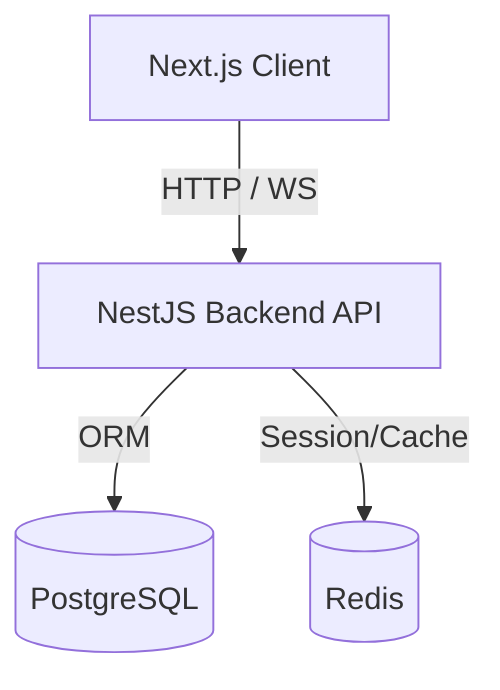

# Restaurant OS SaaS Platform

A multi-tenant, high-performance SaaS platform built for modern restaurants. Features real-time table dining dashboards, QR code menu scanning, cashier billing consolidation, and interactive cooking ticket displays.

---

## 1. Project Overview
Restaurant OS allows restaurant owners to digitalize their dining operations. Customers scan unique table QR codes, join a persistent dining table session, browse menus, customize dishes (variants/add-ons), and submit orders. Kitchen staff receive orders on live cooking queues, waiters track dining states, and cashiers generate consolidated bills per table session (open bill).

---

## 2. Technology Stack
* **Frontend**: Next.js 15 (App Router, TailwindCSS, Zustand Store)
* **Backend**: NestJS 10 (TypeScript, REST APIs, Socket.IO WebSockets)
* **Database**: PostgreSQL (Prisma ORM, atomic transactions)
* **Caching & Session State**: Redis
* **Containerization**: Docker Compose

---

## 3. Architecture
Restaurant OS follows a clean monorepo structure with independent micro-workspaces:


* **Multi-Tenant Isolation**: Every database query is scoped under a parent `restaurantId` constraint. Cross-tenant leakage is strictly prevented at the Prisma layer.
* **Table Sessions (Open Bills)**: Groups multiple orders submitted from different devices at the same table under one session. Consolidates invoices per session while maintaining individual guest order histories private to their device.
* **Persistent Sessions**: Syncs device order arrays and guest IDs with browser `localStorage`, ensuring data survivability across reloads.

---

## 4. Folder Structure
```
├── apps/
│   ├── backend/        # NestJS API gateway, controller routing, prisma schemas
│   └── frontend/       # Next.js customer panel & owner administration dashboard
├── packages/
│   ├── constants/      # Shared configuration keys, business limits, states
│   ├── types/          # Shared TypeScript interfaces & types
│   ├── utils/          # Generic helper modules (currency, dates)
│   └── validation/     # Shared Zod/class-validator schemas
├── docker-compose.yml  # Docker environment configurations for Postgres & Redis
└── package.json        # Workspace manager configurations
```

---

## 5. Development Setup & Deployment

### Prerequisite Checklist
* **NodeJS**: Version 20.x or higher
* **Docker Desktop**: Opened and running

### Step-by-Step Setup
1. **Clone the Repository**:
   ```bash
   git clone https://github.com/huespire/restaurant-os.git
   cd restaurant-os
   ```

2. **Configure Environment Variables**:
   Copy `.env.example` to the workspace files:
   ```bash
   cp .env.example apps/backend/.env
   cp .env.example apps/frontend/.env.local
   ```
   *(Note: Ensure that the backend and frontend point to the correct port bindings).*

3. **Install Dependencies**:
   ```bash
   npm install
   ```

4. **Spin Up Database & Cache (Docker)**:
   ```bash
   npm run docker:dev
   ```

5. **Deploy Prisma Migrations**:
   ```bash
   npx prisma migrate deploy --schema=apps/backend/prisma/schema.prisma
   ```

6. **Seed the Database**:
   Runs the idempotent seed system (safe to run repeatedly):
   ```bash
   npm run db:seed
   ```

7. **Start Development Servers**:
   ```bash
   npm run dev
   ```
   * **Backend API**: `http://localhost:5000`
   * **Frontend Panel**: `http://localhost:3002` (or falls back to `3000`)
   * **Prisma Studio**: `http://localhost:5555`

---

## 6. Project Scripts
Available commands in the monorepo root:
* `npm run dev`: Runs frontend and backend concurrently in watch mode.
* `npm run build`: Compiles all packages and applications for production.
* `npm run lint`: Performs static analysis and ESLint code checks.
* `npm run db:seed`: Seeds initial platform data.
* `npm run db:generate`: Generates the Prisma client.
* `npm run db:migrate`: Creates and applies local development schema changes.
* `npm run docker:dev`: Starts Postgres and Redis containers in detached mode.
* `npm run docker:dev:down`: Stops database containers and preserves volumes.

---

## 7. Demo Credentials

Use these pre-configured user credentials to log in to the system:

### Platform Manager
* **Role**: Super Admin
* **Email**: `admin@restaurantos.local`
* **Password**: `Admin@123`

### Demo Restaurant (Subdomain: `demo`)
* **Owner Account**:
  * **Email**: `owner@restaurantos.local`
  * **Password**: `Owner@123`
* **Manager Account**:
  * **Email**: `manager@restaurantos.local`
  * **Password**: `Manager@123`
* **Waiter Account**:
  * **Email**: `waiter@restaurantos.local`
  * **Password**: `Waiter@123`
* **Kitchen Staff**:
  * **Email**: `kitchen@restaurantos.local`
  * **Password**: `Kitchen@123`
* **Cashier Account**:
  * **Email**: `cashier@restaurantos.local`
  * **Password**: `Cashier@123`

---

## 8. Troubleshooting
* **Database Connection Refused**: Confirm Docker Desktop is running and Postgres container is healthy on port `5435`.
* **Prisma Client Generation Issue**: Run `npm run db:generate` to synchronize Typescript declarations with the latest schema definitions.
* **Port Bound Error**: If port `3000` or `5000` is bound, free the port or change `PORT` in `.env`.

---

## 9. Future Roadmap
* [ ] Multi-lingual menu translation support.
* [ ] Integrated Stripe and Razorpay checkout processors.
* [ ] Offline-first fallback using service workers.
* [ ] Rich analytics reports for owners.
